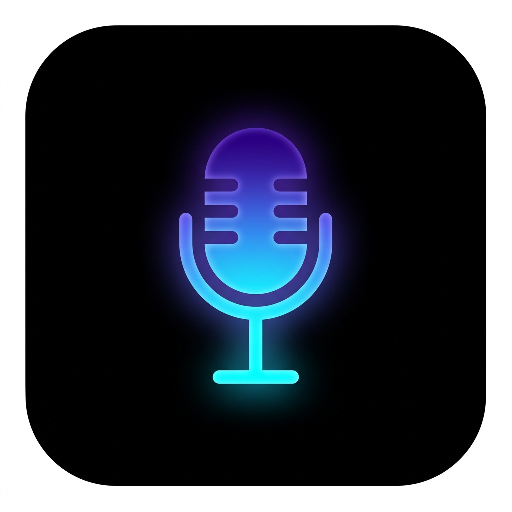

<div align="center">


# VoiceOS

**Say it once, let it go.**
A voice-first operating layer: speech → intent → JSON → action.
Dictation and agent modes in a Mac-notch interface. 100% local, 100% free.

</div>

---

## ⚡ Simple installer

**macOS** — double-click `install.command`
(or run `./install.sh`)

**Windows** — double-click `install.bat`

**Linux** — `./install.sh`

That's it. No downloads, no accounts, no dependencies to install —
the launcher uses the Python 3 or Node already on your machine, starts a
local server, and opens VoiceOS in your browser.

Then optionally click **⬇ Install** in the VoiceOS menu bar to add it to
your Dock / Start Menu like a native app (works offline from then on).

---

## 🖥️ Native desktop build (optional)

For the true always-on-top notch window with a **global hotkey**:

```bash
cd desktop
npm install      # one-time, downloads Electron (free)
npm start        # run it
npm run dist     # build .dmg (Mac) / .exe (Windows) installers
```

See [desktop/README.md](desktop/README.md) — build installers on the target
OS; macOS signing requires a Mac + Apple Developer ID (free builds work
without it, with a one-time "Open Anyway").

---

## 🎙️ What it does

| Mode | Example | Result |
| --- | --- | --- |
| **Dictation** | “Take a note: um the rollout uh went fine” | fillers stripped, typed into Notes |
| **Email** | “Send email to John about the meeting” | draft → **SEND** card → Sent |
| **Calendar** | “Schedule meeting with Sarah next week” | event on calendar, invite prompt |
| **Messages** | “Reply to Maya” | reads thread → captures reply → sends |
| **Files** | “Find last year’s tax returns” | search card → opens Files at match |
| **Search** | “Search web for focus music” | web result card |
| **Reminders** | “Remind me to call Joan tomorrow at 9am” | time-smart reminder |
| **Apps** | “Open Notes” / “Close Mail” | window control |

Ambiguity is handled (“Send message” → *“To who?”* with tap-to-pick
contacts), and risky requests (passwords, mass deletes) are always refused.

## ⚙️ Settings

First-run onboarding, then the ⚙️ menu:
**voice · speaking speed · confirmation level** (always / big stuff only /
never) · **verbosity** · privacy (local-only) · reset & wipe.
Notes, events, threads, and history persist across restarts.

## 🔒 Privacy

No servers, no telemetry, no API keys. Audio and transcripts never leave
your device. Speech-to-text and text-to-speech use the engines built into
your OS/browser. All data lives in your browser's local storage.

## 🧪 Quality

```bash
npm test   # 40 checks: parser, confirmations, persistence, full pipeline
```

## Repo layout

```
index.html · styles.css · app.js   the app (zero-dependency vanilla JS)
manifest.webmanifest · sw.js        PWA: installable + offline
install.sh · install.command        one-step installer for macOS/Linux
install.bat                         one-step installer for Windows
icons/                              app icons (generated)
desktop/                            Electron shell (notch window + hotkey)
tests/smoke.js                      headless test drive of the spec
```

## Roadmap

- [ ] Universal dictation into any app (accessibility bridge — desktop shell ready)
- [ ] Real Gmail/Calendar/Slack via OAuth
- [ ] On-device Whisper STT option
- [ ] Contact learning from corrections
